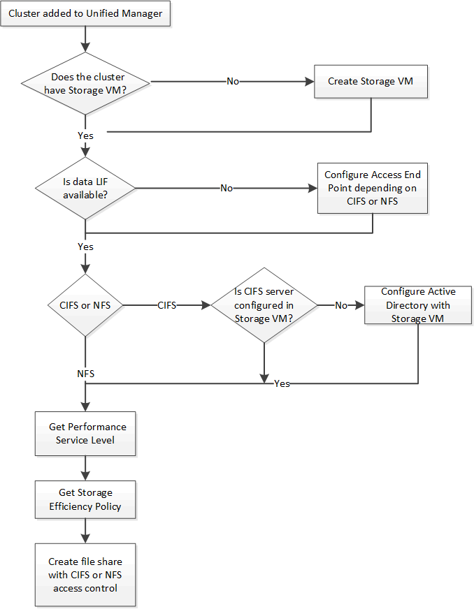

= Aprovisionamiento de recursos compartidos de archivos CIFS y NFS mediante API
:allow-uri-read: 
:icons: font
:imagesdir: ../media/

[role="lead"]
Puede aprovisionar recursos compartidos de CIFS y recursos compartidos de archivos NFS en las máquinas virtuales de almacenamiento (SVM) mediante las API de aprovisionamiento proporcionadas como parte de Active IQ Unified Manager. Este flujo de trabajo de aprovisionamiento detalla los pasos para recuperar las claves de las SVM, los niveles de servicio de rendimiento y las políticas de eficiencia del almacenamiento antes de crear los recursos compartidos de archivos.

En el siguiente diagrama se ilustra cada paso de un flujo de trabajo de aprovisionamiento de recursos compartidos de archivos. Incluye aprovisionamiento de recursos compartidos CIFS y recursos compartidos de archivos NFS.

[NOTE]
====
Asegúrese de lo siguiente:

* Los clústeres de ONTAP se añadieron a Unified Manager y se obtuvo la clave de clúster.
* Se han creado las instancias de SVM en los clústeres.
* Las SVM admiten servicios CIFS y NFS. El aprovisionamiento de recursos compartidos de archivos puede fallar si las SVM no admiten los servicios necesarios.
* El puerto FCP está en línea para el aprovisionamiento de puertos.

====
. Determine si los LIF de datos o extremos de acceso están disponibles en la SVM en la que desea crear el recurso compartido de CIFS. Obtenga la lista de extremos de acceso disponibles en la SVM:
+
[cols="3*"]
|===
| Categoría | Verbo HTTP | Ruta 

 a| 
proveedor de almacenamiento
 a| 
OBTENGA
 a| 
`/storage-provider/access-endpoints`
`/storage-provider/access-endpoints/\{key}`

|===
+
*Muestra de rizo*

+
[listing]
----
curl -X GET "https://<hostname>/api/storage-provider/access-endpoints?resource.key=7d5a59b3-953a-11e8-8857-00a098dcc959" -H "accept: application/json" -H "Authorization: Basic <Base64EncodedCredentials>"
----
. Si su extremo de acceso está disponible en la lista, obtenga la clave de extremo de acceso; de lo contrario, cree el extremo de acceso.
+
[NOTE]
====
Asegúrese de crear extremos de acceso que tengan habilitado el protocolo CIFS en ellos. El aprovisionamiento de recursos compartidos de CIFS produce un error a menos que se haya creado un extremo de acceso con el protocolo CIFS habilitado en él.

====
+
[cols="3*"]
|===
| Categoría | Verbo HTTP | Ruta 

 a| 
proveedor de almacenamiento
 a| 
PUBLICAR
 a| 
`/storage-provider/access-endpoints`

|===
+
*Muestra de rizo*

+
Debe introducir los detalles del extremo de acceso que desea crear, como parámetros de entrada.

+
[listing]
----
curl -X POST "https://<hostname>/api/storage-provider/access-endpoints" -H "accept: application/json" -H "Content-Type: application/json" -H "Authorization: Basic <Base64EncodedCredentials>"
{ \"data_protocols\": \"nfs\",
\"fileshare\": { \"key\": \"cbd1757b-0580-11e8-bd9d-00a098d39e12:type=volume,uuid=f3063d27-2c71-44e5-9a69-a3927c19c8fc\" },
\"gateway\": \"10.132.72.12\",
\"ip\": { \"address\": \"10.162.83.26\",
\"ha_address\": \"10.142.83.26\",
\"netmask\": \"255.255.0.0\" },
\"lun\": { \"key\": \"cbd1757b-0580-11e8-bd9d-00a098d39e12:type=lun,uuid=d208cc7d-80a3-4755-93d4-5db2c38f55a6\" },
\"mtu\": 15000, \"name\": \"aep1\",
\"svm\": { \"key\": \"cbd1757b-0580-11e8-bd9d-00a178d39e12:type=vserver,uuid=1d1c3198-fc57-11e8-99ca-00a098d38e12\" },
\"vlan\": 10}"
----
+
El resultado de JSON muestra una clave de objeto de trabajo que se puede utilizar para verificar el extremo de acceso que se ha creado.

. Compruebe el extremo de acceso:
+
[cols="3*"]
|===
| Categoría | Verbo HTTP | Ruta 

 a| 
servidor de gestión
 a| 
OBTENGA
 a| 
`/management-server/jobs/\{key}`

|===
. Determine si tiene que crear un recurso compartido CIFS o un recurso compartido de archivos NFS. Para crear recursos compartidos de CIFS, siga estos pasos:
+
.. Determinar si el servidor CIFS está configurado en la SVM, que es determinar si se ha creado una asignación de Active Directory en la SVM.
+
[cols="3*"]
|===
| Categoría | Verbo HTTP | Ruta 

 a| 
proveedor de almacenamiento
 a| 
OBTENGA
 a| 
`/storage-provider/active-directories-mappings`

|===
.. Si se crea la asignación de Active Directory, tome la clave de nuevo y cree el mapa de Active Directory en la SVM.
+
[cols="3*"]
|===
| Categoría | Verbo HTTP | Ruta 

 a| 
proveedor de almacenamiento
 a| 
PUBLICAR
 a| 
`/storage-provider/active-directories-mappings`

|===
+
*Muestra de rizo*

+
Debe introducir los detalles para crear la asignación de Active Directory como parámetros de entrada.

+
[listing]
----
curl -X POST "https://<hostname>/api/storage-provider/active-directories-mappings" -H "accept: application/json" -H "Content-Type: application/json" -H "Authorization: Basic <Base64EncodedCredentials>"
{ \"_links\": {},
\"dns\": \"10.000.000.000\",
\"domain\": \"example.com\",
\"password\": \"string\",
\"svm\": { \"key\": \"9f4ddea-e395-11e9-b660-005056a71be9:type=vserver,uuid=191a554a-f0ce-11e9-b660-005056a71be9\" },
\"username\": \"string\"}"
----
+
Se trata de una llamada síncrona y puede comprobar la creación de la asignación de Active Directory en la salida. En caso de error, se muestra el mensaje de error para que pueda solucionar y volver a ejecutar la solicitud.

. Obtenga la clave de SVM de la SVM en la que desea crear el recurso compartido de CIFS o el recurso compartido de archivos NFS, como se describe en el tema de flujo de trabajo _verificando SVM en clústeres_.
. Obtenga la clave para el nivel de servicio de rendimiento ejecutando la siguiente API y recuperando la clave de la respuesta.
+
[cols="3*"]
|===
| Categoría | Verbo HTTP | Ruta 

 a| 
proveedor de almacenamiento
 a| 
OBTENGA
 a| 
`/storage-provider/performance-service-levels`

|===
+
[NOTE]
====
Para recuperar los detalles de los niveles de servicio de rendimiento definidos por el sistema, configure el `system_defined` introduzca el parámetro a. `true`. En el resultado, obtenga la clave del nivel de servicio de rendimiento que desea aplicar en el recurso compartido de archivos.

====
. Opcionalmente, obtenga la clave de la Política de eficiencia del almacenamiento de la Política de eficiencia del almacenamiento que desea aplicar en el recurso compartido de archivos ejecutando la siguiente API y recuperando la clave de la respuesta.
+
[cols="3*"]
|===
| Categoría | Verbo HTTP | Ruta 

 a| 
proveedor de almacenamiento
 a| 
OBTENGA
 a| 
`/storage-provider/storage-efficiency-policies`

|===
. Cree el recurso compartido de archivos. Puede crear un recurso compartido de archivos compatible tanto con CIFS como NFS especificando la lista de control de acceso y la política de exportación. En los siguientes subpasos, se proporciona información si desea crear un recurso compartido de archivos para admitir solo uno de los protocolos en el volumen. También puede actualizar un recurso compartido de archivos NFS para incluir la lista de control de acceso después de crear el recurso compartido NFS. Para obtener información, consulte el tema _Modificar cargas de trabajo de almacenamiento_.
+
.. Para crear solo un recurso compartido de CIFS, recopile la información acerca de la lista de control de acceso (ACL). Para crear el recurso compartido CIFS, proporcione valores válidos para los siguientes parámetros de entrada. Para cada grupo de usuarios que asigne, se crea una ACL cuando se aprovisiona un recurso compartido de CIFS/SMB. En función de los valores introducidos para la asignación de ACL y Active Directory, el control de acceso y la asignación se determinan para el recurso compartido CIFS cuando se crea.
+
*Un comando curl con valores de ejemplo*

+
[listing]
----
{
  "access_control": {
    "acl": [
      {
        "permission": "read",
        "user_or_group": "everyone"
      }
    ],
    "active_directory_mapping": {
      "key": "3b648c1b-d965-03b7-20da-61b791a6263c"
    },
----
.. Para crear únicamente un recurso compartido de archivos NFS, recopile la información acerca de la política de exportación. Para crear el recurso compartido de archivos NFS, proporcione valores válidos para los siguientes parámetros de entrada. La política de exportación, en función de sus valores, se asocia al recurso compartido de archivos NFS cuando se crea.
+
[NOTE]
====
Al aprovisionar el recurso compartido de NFS, puede crear una política de exportación proporcionando todos los valores necesarios o proporcionar la clave de la política de exportación y reutilizar una política de exportación existente. Si desea reutilizar una política de exportación para la máquina virtual de almacenamiento, deberá añadir la clave de política de exportación. A menos que conozca la clave, puede recuperar la clave de política de exportación mediante la `/datacenter/protocols/nfs/export-policies` API. Para crear una nueva política, debe introducir las reglas tal y como se muestran en la siguiente muestra. Para las reglas introducidas, la API intenta buscar una política de exportación existente conciliando el host, la máquina virtual de almacenamiento y las reglas. Si existe una política de exportación existente, se utiliza. De lo contrario, se creará una nueva política de exportación.

====
+
*Un comando curl con valores de ejemplo*

+
[listing]
----
"export_policy": {
      "key": "7d5a59b3-953a-11e8-8857-00a098dcc959:type=export_policy,uuid=1460288880641",
      "name_tag": "ExportPolicyNameTag",
      "rules": [
        {
          "clients": [
            {
              "match": "0.0.0.0/0"
            }
----

+
Después de configurar la lista de control de acceso y la política de exportación, proporcione los valores válidos para los parámetros de entrada obligatorios para los recursos compartidos de archivos CIFS y NFS:

[NOTE]
====
Política de eficiencia de almacenamiento es un parámetro opcional para crear recursos compartidos de archivos.

====
[cols="3*"]
|===
| Categoría | Verbo HTTP | Ruta 

 a| 
proveedor de almacenamiento
 a| 
PUBLICAR
 a| 
`/storage-provider/file-shares`

|===
El resultado JSON muestra una clave de objeto Job que puede utilizar para verificar el recurso compartido de archivos que ha creado. . Verifique la creación del recurso compartido de archivos mediante la clave de objeto Job devuelta al consultar el trabajo:

[cols="3*"]
|===
| Categoría | Verbo HTTP | Ruta 

 a| 
servidor de gestión
 a| 
OBTENGA
 a| 
`/management-server/jobs/\{key}`

|===
Al final de la respuesta, verá la clave del recurso compartido de archivos creado.

[listing]
----

    ],
    "job_results": [
        {
            "name": "fileshareKey",
            "value": "7d5a59b3-953a-11e8-8857-00a098dcc959:type=volume,uuid=e581c23a-1037-11ea-ac5a-00a098dcc6b6"
        }
    ],
    "_links": {
        "self": {
            "href": "/api/management-server/jobs/06a6148bf9e862df:-2611856e:16e8d47e722:-7f87"
        }
    }
}
----
. Compruebe la creación del recurso compartido de archivos ejecutando la siguiente API con la clave devuelta:
+
[cols="3*"]
|===
| Categoría | Verbo HTTP | Ruta 

 a| 
proveedor de almacenamiento
 a| 
OBTENGA
 a| 
`/storage-provider/file-shares/\{key}`

|===
+
*Ejemplo de salida JSON*

+
Puede ver que el método POST de `/storage-provider/file-shares` Invoca internamente todas las API necesarias para cada una de las funciones y crea el objeto. Por ejemplo, invoca el `/storage-provider/performance-service-levels/` API para asignar el nivel de servicio de rendimiento en el recurso compartido de archivos.

+
[listing]
----
{
    "key": "7d5a59b3-953a-11e8-8857-00a098dcc959:type=volume,uuid=e581c23a-1037-11ea-ac5a-00a098dcc6b6",
    "name": "FileShare_377",
    "cluster": {
        "uuid": "7d5a59b3-953a-11e8-8857-00a098dcc959",
        "key": "7d5a59b3-953a-11e8-8857-00a098dcc959:type=cluster,uuid=7d5a59b3-953a-11e8-8857-00a098dcc959",
        "name": "AFFA300-206-68-70-72-74",
        "_links": {
            "self": {
                "href": "/api/datacenter/cluster/clusters/7d5a59b3-953a-11e8-8857-00a098dcc959:type=cluster,uuid=7d5a59b3-953a-11e8-8857-00a098dcc959"
            }
        }
    },
    "svm": {
        "uuid": "b106d7b1-51e9-11e9-8857-00a098dcc959",
        "key": "7d5a59b3-953a-11e8-8857-00a098dcc959:type=vserver,uuid=b106d7b1-51e9-11e9-8857-00a098dcc959",
        "name": "RRT_ritu_vs1",
        "_links": {
            "self": {
                "href": "/api/datacenter/svm/svms/7d5a59b3-953a-11e8-8857-00a098dcc959:type=vserver,uuid=b106d7b1-51e9-11e9-8857-00a098dcc959"
            }
        }
    },
    "assigned_performance_service_level": {
        "key": "1251e51b-069f-11ea-980d-fa163e82bbf2",
        "name": "Value",
        "peak_iops": 75,
        "expected_iops": 75,
        "_links": {
            "self": {
                "href": "/api/storage-provider/performance-service-levels/1251e51b-069f-11ea-980d-fa163e82bbf2"
            }
        }
    },
    "recommended_performance_service_level": {
        "key": null,
        "name": "Idle",
        "peak_iops": null,
        "expected_iops": null,
        "_links": {}
    },
    "space": {
        "size": 104857600
    },
    "assigned_storage_efficiency_policy": {
        "key": null,
        "name": "Unassigned",
        "_links": {}
    },
    "access_control": {
        "acl": [
            {
                "user_or_group": "everyone",
                "permission": "read"
            }
        ],
        "export_policy": {
            "id": 1460288880641,
            "key": "7d5a59b3-953a-11e8-8857-00a098dcc959:type=export_policy,uuid=1460288880641",
            "name": "default",
            "rules": [
                {
                    "anonymous_user": "65534",
                    "clients": [
                        {
                            "match": "0.0.0.0/0"
                        }
                    ],
                    "index": 1,
                    "protocols": [
                        "nfs3",
                        "nfs4"
                    ],
                    "ro_rule": [
                        "sys"
                    ],
                    "rw_rule": [
                        "sys"
                    ],
                    "superuser": [
                        "none"
                    ]
                },
                {
                    "anonymous_user": "65534",
                    "clients": [
                        {
                            "match": "0.0.0.0/0"
                        }
                    ],
                    "index": 2,
                    "protocols": [
                        "cifs"
                    ],
                    "ro_rule": [
                        "ntlm"
                    ],
                    "rw_rule": [
                        "ntlm"
                    ],
                    "superuser": [
                        "none"
                    ]
                }
            ],
            "_links": {
                "self": {
                    "href": "/api/datacenter/protocols/nfs/export-policies/7d5a59b3-953a-11e8-8857-00a098dcc959:type=export_policy,uuid=1460288880641"
                }
            }
        }
    },
    "_links": {
        "self": {
            "href": "/api/storage-provider/file-shares/7d5a59b3-953a-11e8-8857-00a098dcc959:type=volume,uuid=e581c23a-1037-11ea-ac5a-00a098dcc6b6"
        }
    }
}
----

