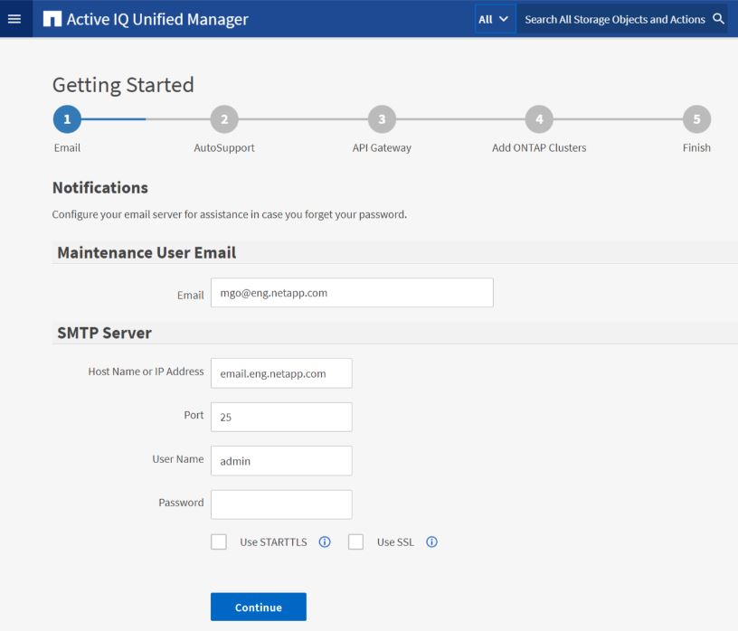

= Realizando la configuración inicial de la interfaz de usuario web de Unified Manager
:allow-uri-read: 
:icons: font
:imagesdir: ../media/

[role="lead"]
Para utilizar Unified Manager, primero es necesario configurar las opciones de configuración iniciales, incluido el servidor NTP, la dirección de correo electrónico del usuario de mantenimiento, el host del servidor SMTP y añadir clústeres de ONTAP.

*Lo que necesitará*

Debe haber realizado las siguientes operaciones:

* Inició la interfaz de usuario web de Unified Manager mediante la URL proporcionada después de la instalación
* Inició sesión con el nombre de usuario y la contraseña de mantenimiento (usuario umadmin para instalaciones Linux) creados durante la instalación

La página Active IQ Unified Manager Getting Started aparece solo cuando se accede por primera vez a la interfaz de usuario web. La siguiente página procede de una instalación en VMware.

Si desea cambiar alguna de estas opciones más adelante, puede seleccionar su opción en las opciones General del panel de navegación izquierdo de Unified Manager. Tenga en cuenta que la configuración de NTP es solo para instalaciones de VMware y se puede cambiar más adelante con la consola de mantenimiento de Unified Manager.

.Pasos
. En la página Active IQ Unified Manager Initial Setup, introduzca la dirección de correo electrónico de usuario de mantenimiento, el nombre de host del servidor SMTP y todas las opciones adicionales SMTP, y el servidor NTP (solo instalaciones VMware). A continuación, haga clic en *continuar*.
+
[NOTE]
====
Si ha seleccionado la opción *usar STARTTLS* o *usar SSL*, aparecerá una página de certificado después de hacer clic en el botón *continuar*. Compruebe los detalles del certificado y acepte el certificado para continuar con la configuración inicial de la interfaz de usuario web.

====
. En la página AutoSupport, haga clic en *Acepto y continúe* para activar el envío de mensajes de AutoSupport desde Unified Manager a Active IQ de NetApp.
+
Si necesita designar un proxy para proporcionar acceso a Internet con el fin de enviar contenido AutoSupport, o si desea desactivar AutoSupport, utilice la opción *General* > *AutoSupport* de la interfaz de usuario web.

. En los sistemas Red Hat y CentOS, cambie la contraseña de usuario umadmin de la cadena "'admin'" predeterminada a una cadena personalizada.
. En la página Set up API Gateway, seleccione si desea utilizar la función API Gateway que permite a Unified Manager gestionar los clústeres de ONTAP que planea supervisar mediante API de REST de ONTAP. A continuación, haga clic en *continuar*.
+
Puede activar o desactivar esta configuración más adelante en la interfaz de usuario web desde *General* > *Configuración de la función* > *puerta de enlace API*. Para obtener más información sobre las API, consulte link:../api-automation/concept_get_started_with_um_apis.html["Primeros pasos con API de REST de Active IQ Unified Manager"].

. Añada los clústeres que desea que Unified Manager administre y haga clic en *Siguiente*. Para cada clúster que vaya a administrar, debe tener el nombre de host o la dirección IP de administración del clúster (IPv4 o IPv6) junto con las credenciales de nombre de usuario y contraseña; el usuario debe tener el rol «'admin'».
+
Este paso es opcional. Puede agregar clústeres más adelante en la interfaz de usuario web desde *Storage Management* > *Cluster Setup*.

. En la página Summary (Resumen), compruebe que todos los ajustes son correctos y haga clic en *Finish* (Finalizar).

Se cierra la página Getting Started y se muestra la página Unified Manager Dashboard.
