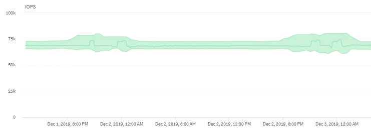

= Cómo las operaciones del clúster pueden afectar a la latencia de carga de trabajo
:allow-uri-read: 
:icons: font
:imagesdir: ../media/

[role="lead"]
Las operaciones (IOPS) representan la actividad de todas las cargas de trabajo definidas por el usuario y definidas por el sistema en un clúster. Las estadísticas de IOPS le ayudan a determinar si los procesos del clúster, como hacer backups o ejecutar deduplicación, están afectando a la latencia de las cargas de trabajo (tiempo de respuesta) o podrían haber provocado o contribuido a un evento de rendimiento.

Al analizar los eventos de rendimiento, puede utilizar las estadísticas de IOPS para determinar si un evento de rendimiento fue causado por un problema en el clúster. Es posible identificar las actividades de carga de trabajo específicas que pueden haber contribuido principalmente al evento de rendimiento. Las IOPS se miden en operaciones por segundo (OPS/s).

Este ejemplo muestra el gráfico IOPS. Las estadísticas de operaciones reales son una línea azul y las estadísticas de operaciones de IOPS se muestran en verde.

[NOTE]
====
En algunos casos en los que se sobrecarga un clúster, es posible que Unified Manager muestre el mensaje `Data collection is taking too long on Cluster _cluster_name_`. Esto significa que no se han recopilado suficientes estadísticas para que Unified Manager las analice. Debe reducir los recursos que está utilizando el clúster para poder recopilar las estadísticas.

====