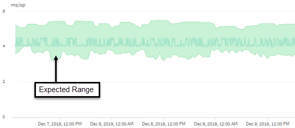

= Cómo se utiliza el pronóstico de latencia en el análisis de rendimiento
:allow-uri-read: 
:icons: font
:imagesdir: ../media/

[role="lead"]
Unified Manager usa el pronóstico de latencia para representar la actividad de latencia de I/o típica (tiempo de respuesta) para las cargas de trabajo supervisadas. Le avisa cuando la latencia real de una carga de trabajo se encuentra por encima de los límites superiores de la previsión de latencia, que activa un evento de rendimiento dinámico, para que pueda analizar el problema de rendimiento y tomar medidas correctivas para resolverlo.

El pronóstico de latencia establece la línea de base de rendimiento para la carga de trabajo. Con el tiempo, Unified Manager aprende de las mediciones de rendimiento anteriores para pronosticar los niveles de rendimiento y actividad esperados para la carga de trabajo. El límite superior del rango esperado establece el umbral de rendimiento dinámico. Unified Manager utiliza la base para determinar cuándo la latencia real está por encima o por debajo de un umbral, o fuera de los límites de su rango esperado. La comparación entre los valores reales y los valores esperados crea un perfil de rendimiento para la carga de trabajo.

Cuando la latencia real de una carga de trabajo supera el umbral de rendimiento dinámico, debido a la contención en un componente de clúster, la latencia es alta y la carga de trabajo se ejecuta más lentamente de lo esperado. El rendimiento de otras cargas de trabajo que comparten los mismos componentes del clúster también puede ser más lento de lo esperado.

Unified Manager analiza el evento de umbral que cruza y determina si la actividad es un evento de rendimiento. Si la actividad de alta carga de trabajo continúa siendo coherente durante un largo periodo de tiempo, como varias horas, Unified Manager considera que la actividad es normal y ajusta de forma dinámica el pronóstico de latencia para formar el nuevo umbral de rendimiento dinámico.

Es posible que algunas cargas de trabajo tengan una actividad baja constante, donde la previsión de latencia no tiene una tasa alta de cambio con el tiempo. Para minimizar el número de eventos durante el análisis de eventos de rendimiento, Unified Manager activa un evento solo en volúmenes de baja actividad cuyas operaciones y latencias son mucho más elevadas de lo esperado.

En este ejemplo, la latencia de un volumen tiene un pronóstico de latencia, en gris, de 3.5 milisegundos por operación (ms/op) a su nivel más bajo y de 5.5 ms/op a su nivel más alto. Si la latencia real, en azul, aumenta de repente a 10 ms/op, debido a un pico intermitente en el tráfico de la red o contención en un componente del clúster, supera la previsión de latencia y ha superado el umbral de rendimiento dinámico.

Cuando se redujo el tráfico de red o el componente del clúster ya no es objeto de disputa, la latencia devuelve dentro de la previsión de latencia. Si la latencia permanece en o por encima de los 10 ms/op durante un largo periodo de tiempo, es posible que deba tomar la acción correctiva para resolver el evento.
