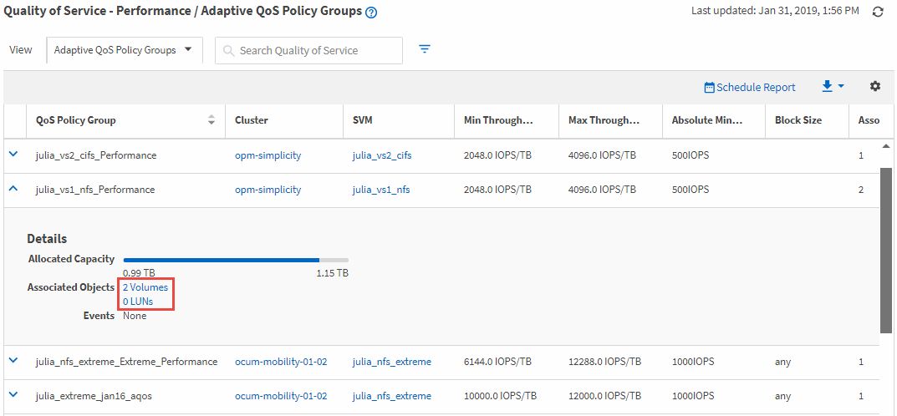

= Ver volúmenes o LUN que estén en el mismo grupo de políticas de calidad de servicio
:allow-uri-read: 
:icons: font
:imagesdir: ../media/

[role="lead"]
Puede mostrar una lista de los volúmenes y LUN que se hayan asignado al mismo grupo de políticas de calidad de servicio.

En el caso de los grupos de políticas de calidad de servicio tradicionales «que son » entre varios volúmenes, puede resultar útil ver si determinados volúmenes están utilizando en exceso el rendimiento definido para el grupo de políticas. También puede ser útil para decidir si puede añadir otros volúmenes al grupo de políticas sin un impacto negativo sobre los otros volúmenes.

En el caso de políticas de calidad de servicio adaptativas y de niveles de servicio de Unified Manager Performance, Esto puede ser útil para ver todos los volúmenes o LUN que utilizan un grupo de políticas, de modo que pueda ver qué objetos se verían afectados si cambia la configuración de la política de calidad de servicio.

.Pasos
. En el panel de navegación izquierdo, haga clic en *almacenamiento* > *grupos de políticas QoS*.
+
La vista rendimiento: Grupos de políticas de calidad de servicio tradicionales se muestra de forma predeterminada.

. Si usted está interesado en el grupo de políticas tradicionales, quédese en esta página. De lo contrario, seleccione una de las opciones adicionales Ver para mostrar todos los grupos de políticas de calidad de servicio adaptativos o todos los grupos de políticas de calidad de servicio creados por los niveles de servicio de rendimiento de Unified Manager.
. En la política QoS que le interesa, haga clic en el botón expandir (image:../media/chevron_down.gif[""]) Junto al nombre del grupo de políticas QoS para ver más detalles.
. Haga clic en el enlace Volumes o LUN para ver los objetos con esta política de calidad de servicio.
+
La página Performance Inventory de los volúmenes o LUN se muestra con la lista ordenada de los objetos que está utilizando la política de calidad de servicio.

