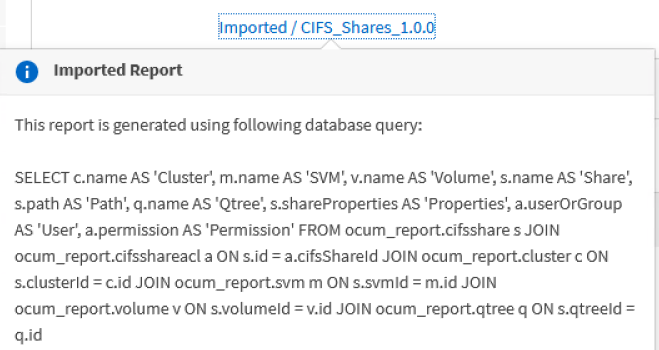

= Programar informes .rptdesign importados
:allow-uri-read: 
:icons: font
:imagesdir: ../media/

[role="lead"]
Es posible programar los informes existentes que se crearon e importaron en una versión anterior de Unified Manager.

La programación de informes importados requiere lo siguiente:

* Se importaron informes de archivos .rptdesign diseñados por BIRT en una versión anterior de Unified Manager
* Esto se aplica cuando se actualiza a Unified Manager 9.6 GA o posterior

Después de actualizar a Unified Manager 9.6 GA o una versión posterior, la página Report Schedules enumera los informes importados. Puede editar la programación de estos informes para especificar las direcciones de correo electrónico, la frecuencia y el formato de los destinatarios (PDF o CSV). De lo contrario, estos informes no se pueden editar ni ver en la interfaz de usuario de Unified Manager.

.Pasos
. Abra la página programas de informes. Si ha importado informes, aparece un mensaje.
+
image::../media/message_non_scehduled_reports.png[mensajes no scehdulled informes]

. Haga clic en el nombre *View* para mostrar la consulta SQL que se utiliza para generar el informe.
+

. Haga clic en el icono más image:../media/more_icon.gif[""], Haga clic en *Editar*, defina los detalles de la programación del informe y guarde el informe.
+
[NOTE]
====
También puede eliminar los informes no deseados del icono más image:../media/more_icon.gif[""].

====

