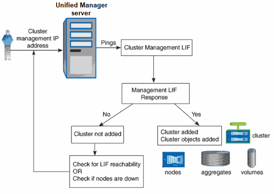

= Cómo funciona el proceso de detección
:allow-uri-read: 
:icons: font
:imagesdir: ../media/

[role="lead"]
Después de agregar el clúster a Unified Manager, el servidor detecta los objetos del clúster y los añade a su base de datos. Comprender cómo funciona el proceso de detección le permite gestionar los clústeres de su organización y sus objetos.

El intervalo de supervisión predeterminado es de 15 minutos: Si ha agregado un clúster al servidor de Unified Manager, se tardan 15 minutos en mostrar los detalles del clúster en la interfaz de usuario de Unified Manager.

En la siguiente imagen se muestra el proceso de detección en Active IQ Unified Manager:

